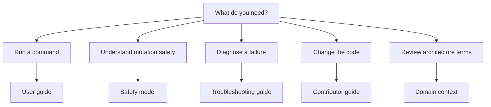

# File Manager Documentation

File Manager is an un-packaged Python CLI. Run it from the repository root with
`python main.py`; `main.py` is the only executable entrypoint.

## Find the Right Guide

Use this map to choose the document that owns the information you need:

## Documentation

- [User guide](user-guide.md) - command syntax, recursive behavior, dry-run, and
  exit statuses.
- [Safety model](safety-model.md) - filtering, symlinks, partial failures,
  deduplication revalidation, and archive publication.
- [Domain context](../CONTEXT.md) - canonical architecture and domain vocabulary.
- [Improvement tasks](tasks.md) - active and completed project work.

The root [README](../README.md) provides installation and a short quick start.
Detailed behavior belongs in these documents so it has one source of truth.
