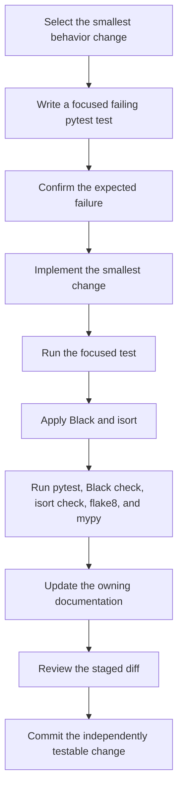

# Contributing

## Environment

File Manager is an un-packaged Python 3.10+ CLI. Run commands from the repository
root so the top-level `functions`, `Interface`, and `utils` imports resolve.
`main.py` is the only executable entrypoint.

```powershell
python -m venv .venv
.venv\Scripts\Activate.ps1
python -m pip install -r requirements.txt
```

## Change Workflow

Use a small red-green-refactor cycle and finish with every explicit repository
check:



There is no CI or pre-commit configuration. The final verification node means
running each command locally rather than waiting for automation.

## Architecture Rules

- Treat `CONTEXT.md` as the canonical domain vocabulary.
- Commands expose `description`, `parse(args, executor)`, and
  `execute(request, logger)`.
- Requests and results are frozen dataclasses. Do not store execution state on a
  reusable Command instance.
- Add a Command to `CommandRegistry.COMMAND_MAP` in `main.py`, add its options to
  the shared parser in `utils/parse_arguments.py`, and update the exact registry
  assertion in `tests/test_registry.py`.
- Put target-file mutations behind semantic methods on `FileSystemExecutor`.
  `CommandHandler` alone chooses `RealFileSystemExecutor` or
  `RecordingFileSystemExecutor`; Commands must not branch on dry-run.
- File-deletion Commands should extend `ProcessFilesCommandBase` and construct an
  immutable `FileFilter`.
- Deduplication must plan before deletion, exclude file symlinks, choose the
  lexicographically smallest normalized absolute path as keeper, and revalidate
  the keeper and duplicate digest immediately before unlinking.

## Test Design

Use pytest's `tmp_path` fixture to build the smallest filesystem tree that proves
one behavior. Assert observable results and target state rather than private call
order. A destructive Command test should normally cover both executors:

- `RecordingFileSystemExecutor` records the intended semantic mutation and leaves
  target files unchanged.
- `RealFileSystemExecutor` applies the mutation and returns `applied=True`.

For failures, inject the error at the executor boundary, assert the structured
result counts and message, and prove later targets still run when the Command
supports partial-failure aggregation. Skip symlink tests only when the platform
cannot create the required link.

## Focused Tests

```powershell
python -m pytest tests/test_deduplicate.py
python -m pytest tests/test_deduplicate.py::test_deduplication_plans_a_deterministic_keeper
```

Use the closest test module during red-green-refactor. Run the full suite before
committing:

```powershell
python -m pytest
```

## Formatting and Static Checks

Apply formatting:

```powershell
python -m black .
python -m isort .
```

Verify the repository:

```powershell
python -m black --check .
python -m isort --check-only .
python -m flake8 .
python -m mypy .
```

Black and isort use line length 88. There is no CI or pre-commit configuration,
so run each check explicitly.

## Documentation Checklist

- Update `docs/user-guide.md` when command syntax or observable behavior changes.
- Update `docs/safety-model.md` when filtering, symlink, partial-failure,
  deduplication-revalidation, or archive-publication behavior changes.
- Update `CONTEXT.md` when canonical domain terms or architecture contracts change.
- Update `docs/troubleshooting.md` when a new user-visible failure mode is added.
- Keep detailed behavior out of the root README; link to the owning document.
- Create all new documentation under `docs/`.

## Commit Discipline

Keep each commit independently testable. Stage only files belonging to the task,
inspect the staged diff, and use a concise message that describes the delivered
behavior or documentation.
