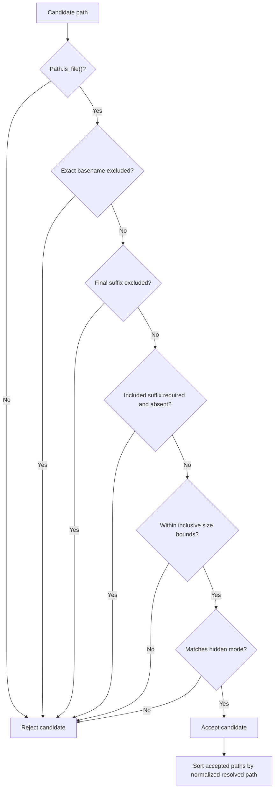
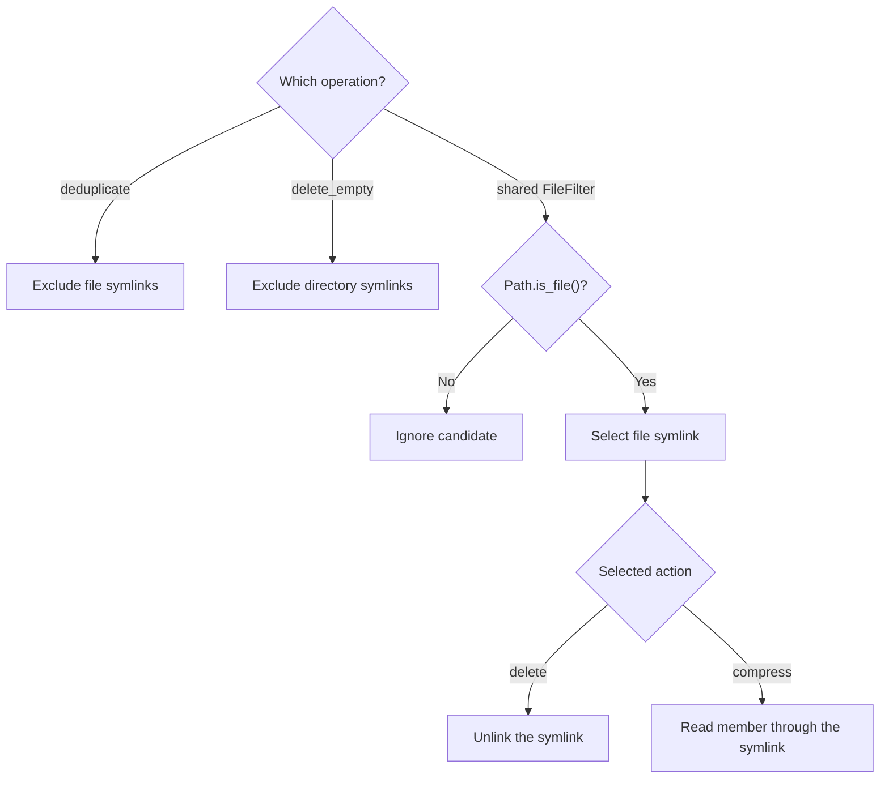
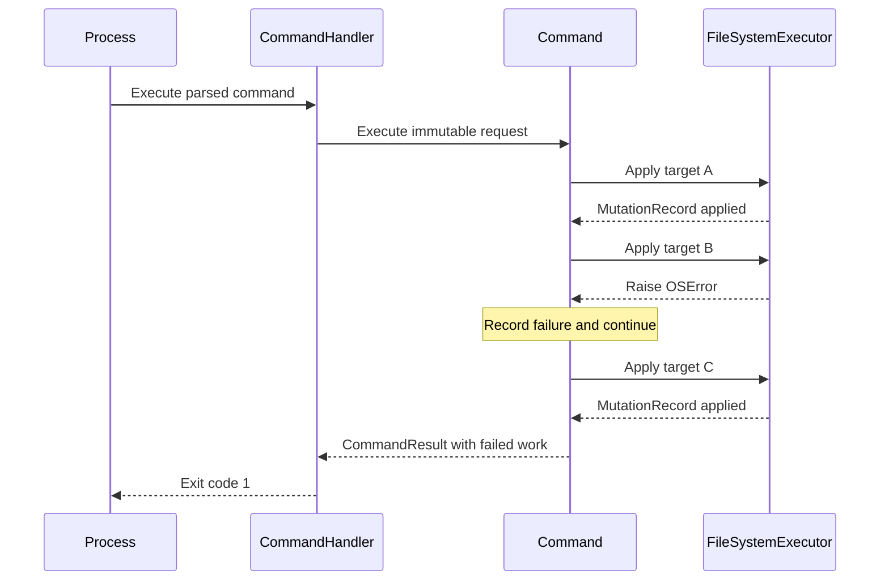
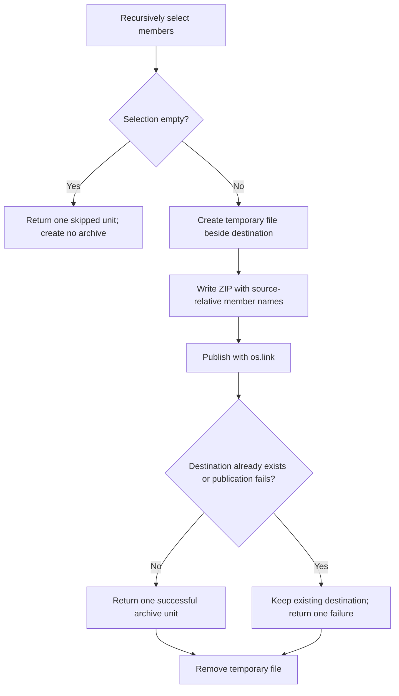

# Safety Model

This document is the source of truth for behavior shared by multiple Commands:
file filtering, symlink treatment, partial failures, deduplication revalidation,
and archive publication. See the [user guide](user-guide.md) for command syntax.

Dry-run replaces the real mutation executor with a recording executor. It still
validates paths, traverses directories, reads metadata, and hashes file contents
for deduplication. Diagnostic logging may create or append to the configured log
file.

## File Selection

`delete_by_extension`, `clean_folder`, `delete_hidden_files`, and
`compress_files` use the immutable `FileFilter`. They call `filter_files()` with
its default `recursive=True`, so candidates at every depth are considered.

The matching pipeline is evaluated in this order:

Extension criteria are case-insensitive and may include a leading dot. Matching
uses only `Path.suffix`, so `archive.tar.gz` has extension `gz`. Excluded
extensions take precedence over included extensions. Excluded names are exact,
case-sensitive basenames.

Minimum and maximum sizes are inclusive. Hidden mode checks the file itself: a
dot-prefixed basename is hidden on every supported platform, and the Windows
hidden attribute is an additional criterion on Windows. Hidden status is not
inherited from parent directories.

## Symlink Treatment

The repository has operation-specific symlink behavior rather than one universal
policy:

Deduplication explicitly excludes file symlinks before hashing. Empty-directory
planning excludes directory symlinks. The shared filter uses `Path.is_file()`,
which can follow a file symlink to determine that it resolves to a regular file.
Deleting that selected path unlinks the symlink, not its target; compression
reads the member through the symlink.

Use dry-run and inspect the selected paths before operating on a tree containing
links.

## Partial Failures and Deduplication Revalidation

File deletion, empty-directory deletion, and deduplication aggregate supported
per-target `OSError` failures. They retain successful mutation records, record
the failed target, and continue with later planned targets:

There is no rollback. If target A changed successfully before target B failed,
target A remains changed. Dry-run records planned mutations as succeeded work
with `MutationRecord.applied=False`; this reports that the intent was recorded,
not that a target was changed.

Deduplication builds its complete `DeduplicationPlan` before requesting any
deletion. It excludes file symlinks and keeps the lexicographically smallest
normalized absolute path in each SHA-256 digest group. Immediately before
unlinking a duplicate, the real executor:

1. captures the duplicate and keeper file state;
2. rehashes both files against the planned digest;
3. checks that neither observed file state changed during revalidation;
4. unlinks the duplicate only after those checks pass.

A failed digest or file-state check raises `MutationPreconditionError`, which is
an `OSError`; deduplication records that duplicate as failed, leaves it in place,
and continues. These checks reduce the stale-plan window but cannot make separate
filesystem reads and unlinking atomic.

Compression differs because one archive is one operation. It converts an
ordinary archive-creation exception into one failed result rather than
aggregating member-level failures.

## Archive Publication

Compression recursively selects members, writes a temporary archive, and
publishes without replacing an existing destination:

The destination is `<source-name>_<YYYYMMDD_HHMMSS>.zip` in the source
directory's parent. Names have one-second precision. `os.link` refuses to
overwrite an existing or concurrently created destination, and publication
requires hard-link support in the destination filesystem.

Archive members use paths relative to the source directory. Temporary output is
removed in a `finally` block after success, ordinary failure, or a process-control
exception. A non-empty selection counts as one attempted archive regardless of
member count.
