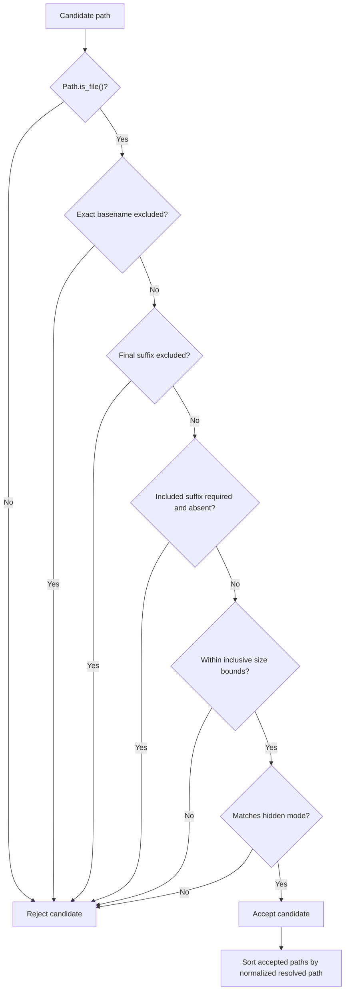
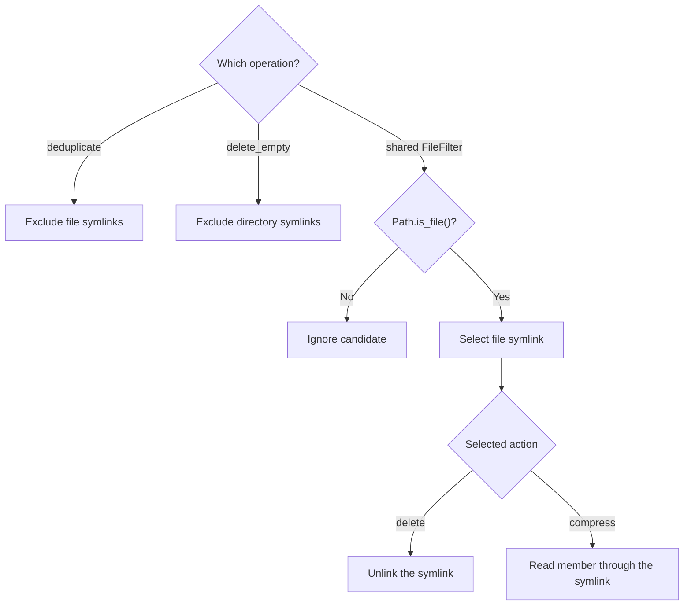
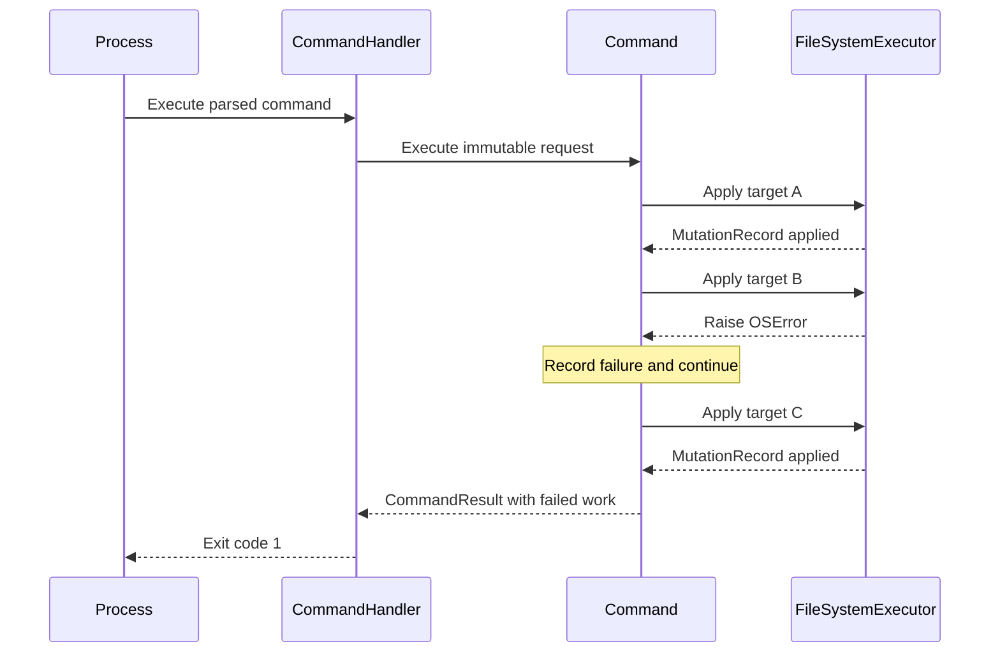
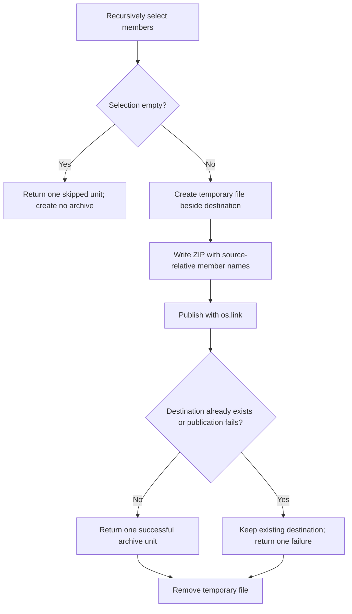
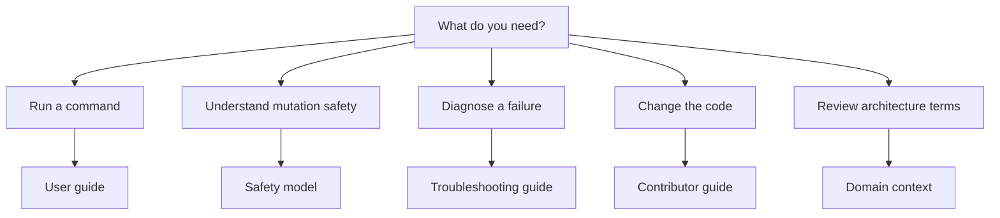
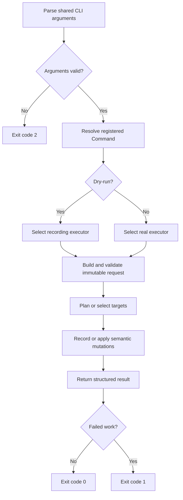
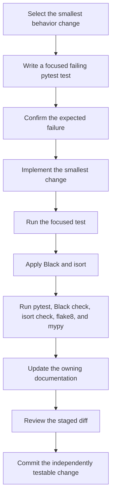
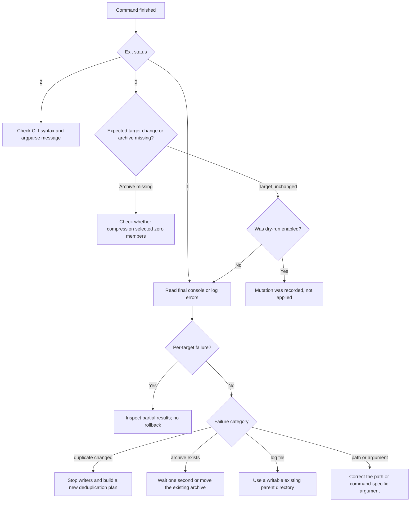

# Documentation Sync Implementation Plan

> **For agentic workers:** REQUIRED SUB-SKILL: Use superpowers:subagent-driven-development (recommended) or superpowers:executing-plans to implement this plan task-by-task. Steps use checkbox (`- [ ]`) syntax for tracking.

**Goal:** Make the repository documentation accurately describe the current CLI, safety behavior, architecture, and development workflow, with focused Mermaid diagrams that clarify navigation and complex behavior without duplicating reference material.

**Architecture:** Keep the root `README.md` as a concise landing page and keep `CONTEXT.md` as the canonical domain vocabulary required by the repository. Put all newly created documentation under `docs/`: `docs/README.md` indexes the set, `docs/user-guide.md` owns CLI behavior, `docs/safety-model.md` owns cross-cutting mutation safety, `docs/contributing.md` owns development and verification, and `docs/troubleshooting.md` owns failure recovery. Each audience guide gets one focused Mermaid diagram; the safety model gets four diagrams for its distinct behaviors.

**Tech Stack:** GitHub-flavored Markdown, Mermaid, Python 3.10+, `pathlib`, pytest, Black, isort, flake8, mypy

## Global Constraints

- Create every new documentation file under `docs/`.
- Keep `CONTEXT.md` as the canonical architecture and domain vocabulary source.
- Document the only executable entrypoint as `python main.py`; do not imply that the project is packaged or has a console-script entrypoint.
- Use the exact registered command names: `deduplicate`, `delete_by_extension`, `clean_folder`, `delete_empty`, `delete_hidden_files`, and `compress_files`.
- Define dry-run as preventing target-file mutations; diagnostic logging may still create or append to the configured log file.
- Preserve the deduplication plan-before-delete behavior, deterministic keeper selection, file-symlink exclusion, and pre-unlink digest revalidation.
- State that `delete_by_extension`, `clean_folder`, `delete_hidden_files`, and `compress_files` recursively traverse descendants.
- Do not add dependencies, Sphinx configuration, release history, or a packaging workflow; those are not required to describe the current un-packaged CLI.
- Keep detailed command behavior in `docs/user-guide.md`; the root `README.md` should link to it rather than duplicate it.
- Keep filtering, symlink, partial-failure, deduplication revalidation, and archive publication details in `docs/safety-model.md`; other guides should link to it.
- Use fenced `mermaid` blocks with `flowchart TD` or `sequenceDiagram`; do not add Mermaid CLI dependencies, click directives, custom themes, initialization blocks, or external assets.
- Give every diagram complete adjacent prose so the documentation remains usable when Mermaid is not rendered.
- Use ASCII in all new and changed documentation.
- Run all repository checks explicitly because there is no CI or pre-commit configuration.

---

## File Structure

- Modify `README.md`: retain the project overview and quick start, correct dry-run wording, and replace duplicated command reference material with links into `docs/`.
- Modify `CONTEXT.md`: correct command identifiers, request type names, normalization claims, and deduplication revalidation wording.
- Modify `docs/tasks.md`: remove stale implementation identifiers, narrow overstated completed tasks, and mark documentation work complete only after its document exists.
- Create `docs/README.md`: provide the single index for user, contributor, troubleshooting, and architecture documentation.
- Create `docs/user-guide.md`: own CLI invocation, command behavior, recursion, dry-run semantics, result units, examples, and exit statuses; link to the safety model for cross-cutting details.
- Create `docs/safety-model.md`: own filtering, symlinks, partial failures, deduplication revalidation, and archive publication with four focused Mermaid diagrams.
- Create `docs/contributing.md`: own environment setup, test design guidance, architecture constraints, and exact verification commands.
- Create `docs/troubleshooting.md`: own common argument, path, logging, partial-failure, archive-collision, and symlink diagnostics.
- Modify `docs/superpowers/plans/2026-08-02-documentation-sync.md`: check completed steps while executing; do not change the planned interfaces or scope without reviewer approval.

## Deliberate Omissions

- Do not create Sphinx API documentation. The repository is an un-packaged CLI, and the public behavior is better served by the user guide and canonical architecture vocabulary.
- Do not create a changelog or release policy. The repository has no documented version or release process from which accurate history can be reconstructed.
- Do not create a separate examples directory. Complete examples belong beside each command in `docs/user-guide.md` to avoid duplicate command documentation.
- Do not add a Mermaid renderer or validation dependency. GitHub is the target renderer; repository checks validate fences, declarations, required labels, and prose coverage.
- Do not move `README.md` or `CONTEXT.md`. Existing repository instructions and conventional repository discovery rely on those paths.

---

### Task 1: Correct Existing Documentation Claims

**Files:**
- Modify: `README.md:19-20,62-67`
- Modify: `CONTEXT.md:10-15,60-77`
- Modify: `docs/tasks.md:13-17,24-33,45-54`
- Test: inline Python documentation assertions

**Interfaces:**
- Consumes: registered command names from `CommandRegistry.COMMAND_MAP` in `main.py`; `CompressFilesRequest` from `functions/CompressFilesCommand.py`; path parsing behavior from all six Commands; deduplication revalidation from `RealFileSystemExecutor.delete_duplicate(path: Path, keeper: Path, expected_digest: str) -> MutationRecord`.
- Produces: canonical command vocabulary and safety wording consumed verbatim by `docs/user-guide.md` and `docs/troubleshooting.md`.

- [x] **Step 1: Run assertions that expose the stale claims**

Run:

```powershell
python -c "from pathlib import Path; context = Path('CONTEXT.md').read_text(); readme = Path('README.md').read_text(); tasks = Path('docs/tasks.md').read_text(); assert 'delete_by_extension' in context; assert 'CompressFilesRequest' in context; assert 'Values required by a Command are parsed into their request before execution.' in context; assert 'without applying target-file mutations' in readme; assert 'shared file filtering for file-selection Commands' in tasks"
```

Expected: FAIL with `AssertionError` because the current documents use hyphenated command names, `CompressRequest`, a blanket normalization claim, broad filesystem wording, and an overstated filtering task.

- [x] **Step 2: Correct the README feature and common-option wording**

In `README.md`, replace the hidden-file feature and common-options table with:

```markdown
- **Delete hidden files** - Remove dot-prefixed files on every supported platform
  and files with the Windows hidden attribute.

| Option        | Default      | Description                                                   |
| ------------- | ------------ | ------------------------------------------------------------- |
| `--command`   | *(required)* | Command to execute.                                           |
| `--log`       | `app.log`    | Path to the diagnostic log file.                              |
| `--log-level` | `INFO`       | Logging level (`DEBUG`, `INFO`, `WARNING`, ...).               |
| `--dry-run`   | `false`      | Simulate the action without applying target-file mutations.   |
```

Keep the surrounding feature list and `### Common options` heading unchanged.

- [x] **Step 3: Correct canonical vocabulary and guarantees in CONTEXT.md**

Replace the `CommandRequest` and `DeduplicationPlan` sections, and correct the command list, so the resulting text is:

```markdown
### Command
A self-contained file-system operation (`deduplicate`, `delete_by_extension`,
`clean_folder`, `delete_empty`, `delete_hidden_files`, or `compress_files`).
Every Command implements `CommandInterface`: `parse(args, executor)`,
`execute(request, logger)`, and a `description` property. Execution returns a
`CommandResult`.

### CommandRequest
A typed, immutable parameter object produced by a Command from command-line
arguments. Values required by a Command are parsed into their request before
execution; each Command owns any value-specific normalization it needs.
Every CommandRequest includes the selected `FileSystemExecutor`; specialised
requests add the inputs required by one Command, e.g. `DeduplicateRequest` or
`CompressFilesRequest`. The `--dry-run` flag selects the executor but is not
retained as a second execution-mode field.

### DeduplicationPlan
The deterministic classification of matching-content files into keepers and
duplicates before any duplicate is removed. File symlinks are excluded. The
lexicographically smallest normalized absolute path is the keeper when no
explicit keeper policy exists. Immediately before unlinking a duplicate, the
real executor revalidates the duplicate and keeper against the planned SHA-256
digest and verifies that their observed file state did not change during that
revalidation.
```

Do not change the `CommandRegistry`, `CommandHandler`, dry-run, executor, or glossary definitions.

- [x] **Step 4: Narrow stale completion claims in docs/tasks.md**

Apply these exact checklist text replacements:

```markdown
7. [x] Use typed results and centralized handler logging for command errors
11. [x] Create shared file filtering for file-selection Commands
2. [x] Replace command-level print() calls with logger calls
3. [x] Remove redundant imports from deduplication validation
4. [x] Remove obsolete helper-module references from ProcessFilesCommandBase
9. [x] Add validation for required command-specific arguments
11. [x] Aggregate per-target OSError failures in destructive Commands
1. [x] Build temporary file trees with pytest's tmp_path fixture
4. [ ] Configure coverage reporting and an explicit coverage threshold
10. [x] Add reusable helpers for repeated test setup
```

These replacements preserve the original item numbers and checkbox states while removing references to deleted identifiers and claims broader than the implementation.

- [x] **Step 5: Re-run the documentation assertions**

Run:

```powershell
python -c "from pathlib import Path; context = Path('CONTEXT.md').read_text(); normalized_context = ' '.join(context.split()); readme = Path('README.md').read_text(); tasks = Path('docs/tasks.md').read_text(); assert all(name in context for name in ('deduplicate', 'delete_by_extension', 'clean_folder', 'delete_empty', 'delete_hidden_files', 'compress_files')); assert 'CompressFilesRequest' in context; assert 'Values required by a Command are parsed into their request before execution;' in normalized_context; assert 'without applying target-file mutations' in readme; assert 'shared file filtering for file-selection Commands' in tasks; assert 'FileDeduplicator._calculate_file_hash' not in tasks; assert 'fm_process_files.py' not in tasks"
```

Expected: PASS with no output.

- [x] **Step 6: Run focused architecture tests**

Run:

```powershell
python -m pytest tests/test_registry.py tests/test_handler.py tests/test_deduplicate.py -q
```

Expected: all selected tests pass; symlink tests may report `SKIPPED` where links cannot be created.

- [x] **Step 7: Commit the corrected claims**

```powershell
git add README.md CONTEXT.md docs/tasks.md
git commit -m "docs: correct command and safety claims"
```

Expected: one commit containing only the three corrected existing documents.

---

### Task 2: Add the Cross-Cutting Safety Model

**Files:**
- Create: `docs/safety-model.md`
- Modify: `CONTEXT.md:72-77`
- Modify: `docs/tasks.md:61-74`
- Test: inline Python content and Mermaid-structure assertions

**Interfaces:**
- Consumes: `FileFilter.matches(file_path: Path) -> bool`; `FileFilter.filter_files(directory: Union[str, Path], recursive: bool = True) -> list[Path]`; `FileSystemExecutor` semantic mutation methods; `RealFileSystemExecutor.delete_duplicate(path: Path, keeper: Path, expected_digest: str) -> MutationRecord`; `RealFileSystemExecutor.create_archive(source: Path, destination: Path, members: Sequence[Path]) -> MutationRecord`; partial-failure result handling from destructive Commands.
- Produces: `docs/safety-model.md` as the sole detailed source for filtering, symlink treatment, partial failures, deduplication revalidation, and archive publication. Tasks 3 and 5 link to this document without restating its internals.

- [x] **Step 1: Run assertions for the missing safety model**

Run:

```powershell
python -c "from pathlib import Path; path = Path('docs/safety-model.md'); assert path.is_file(); text = path.read_text(); fence = chr(96) * 3 + 'mermaid'; assert text.count(fence) == 4; assert text.count('flowchart TD') == 3; assert text.count('sequenceDiagram') == 1"
```

Expected: FAIL with `AssertionError` because `docs/safety-model.md` does not exist.

- [x] **Step 2: Create docs/safety-model.md**

Create `docs/safety-model.md` with exactly:

````markdown
# Safety Model

This document is the source of truth for behavior shared by multiple Commands:
file filtering, symlink treatment, partial failures, deduplication revalidation,
and archive publication. See the [user guide](user-guide.md) for command syntax.

Dry-run replaces the real mutation executor with a recording executor. It still
validates paths, traverses directories, reads metadata, and hashes file contents
for deduplication. Diagnostic logging may create or append to the configured log
file.

## File Selection

`delete_by_extension`, `clean_folder`, `delete_hidden_files`, and
`compress_files` use the immutable `FileFilter`. They call `filter_files()` with
its default `recursive=True`, so candidates at every depth are considered.

The matching pipeline is evaluated in this order:



Extension criteria are case-insensitive and may include a leading dot. Matching
uses only `Path.suffix`, so `archive.tar.gz` has extension `gz`. Excluded
extensions take precedence over included extensions. Excluded names are exact,
case-sensitive basenames.

Minimum and maximum sizes are inclusive. Hidden mode checks the file itself: a
dot-prefixed basename is hidden on every supported platform, and the Windows
hidden attribute is an additional criterion on Windows. Hidden status is not
inherited from parent directories.

## Symlink Treatment

The repository has operation-specific symlink behavior rather than one universal
policy:



Deduplication explicitly excludes file symlinks before hashing. Empty-directory
planning excludes directory symlinks. The shared filter uses `Path.is_file()`,
which can follow a file symlink to determine that it resolves to a regular file.
Deleting that selected path unlinks the symlink, not its target; compression
reads the member through the symlink.

Use dry-run and inspect the selected paths before operating on a tree containing
links.

## Partial Failures and Deduplication Revalidation

File deletion, empty-directory deletion, and deduplication aggregate supported
per-target `OSError` failures. They retain successful mutation records, record
the failed target, and continue with later planned targets:



There is no rollback. If target A changed successfully before target B failed,
target A remains changed. Dry-run records planned mutations as succeeded work
with `MutationRecord.applied=False`; this reports that the intent was recorded,
not that a target was changed.

Deduplication builds its complete `DeduplicationPlan` before requesting any
deletion. It excludes file symlinks and keeps the lexicographically smallest
normalized absolute path in each SHA-256 digest group. Immediately before
unlinking a duplicate, the real executor:

1. captures the duplicate and keeper file state;
2. rehashes both files against the planned digest;
3. checks that neither observed file state changed during revalidation;
4. unlinks the duplicate only after those checks pass.

A failed digest or file-state check raises `MutationPreconditionError`, which is
an `OSError`; deduplication records that duplicate as failed, leaves it in place,
and continues. These checks reduce the stale-plan window but cannot make separate
filesystem reads and unlinking atomic.

Compression differs because one archive is one operation. It converts an
ordinary archive-creation exception into one failed result rather than
aggregating member-level failures.

## Archive Publication

Compression recursively selects members, writes a temporary archive, and
publishes without replacing an existing destination:



The destination is `<source-name>_<YYYYMMDD_HHMMSS>.zip` in the source
directory's parent. Names have one-second precision. `os.link` refuses to
overwrite an existing or concurrently created destination, and publication
requires hard-link support in the destination filesystem.

Archive members use paths relative to the source directory. Temporary output is
removed in a `finally` block after success, ordinary failure, or a process-control
exception. A non-empty selection counts as one attempted archive regardless of
member count.
````

- [x] **Step 3: Link CONTEXT.md to the operational safety details**

Append this paragraph to the `DeduplicationPlan` section in `CONTEXT.md`:

```markdown
Filtering, symlink, partial-failure, revalidation, and archive-publication details
are documented in the [safety model](docs/safety-model.md).
```

- [x] **Step 4: Record completion of the cohesive safety documentation**

Append this item to the Documentation section in `docs/tasks.md`:

```markdown
13. [x] Document filtering, symlinks, partial failures, and archive publication
```

- [x] **Step 5: Verify safety prose and all four Mermaid diagrams**

Run:

```powershell
python -c "from pathlib import Path; text = Path('docs/safety-model.md').read_text(); fence = chr(96) * 3 + 'mermaid'; assert text.count(fence) == 4; assert text.count('flowchart TD') == 3; assert text.count('sequenceDiagram') == 1; assert all(term in text for term in ('recursive=True', 'case-sensitive basenames', 'Exclude file symlinks', 'There is no rollback.', 'MutationPreconditionError', 'os.link', 'one-second precision', 'hard-link support')); assert '[safety model](docs/safety-model.md)' in Path('CONTEXT.md').read_text()"
```

Expected: PASS with no output.

- [x] **Step 6: Run the tests that encode the safety model**

Run:

```powershell
python -m pytest tests/test_deduplicate.py tests/test_file_processing.py tests/test_directory_and_compression.py tests/test_execution.py -q
```

Expected: all selected tests pass; platform-specific symlink tests may report `SKIPPED`.

- [x] **Step 7: Commit the safety model**

```powershell
git add CONTEXT.md docs/safety-model.md docs/tasks.md
git commit -m "docs: define cross-cutting safety model"
```

Expected: one commit containing the cohesive safety reference and its canonical-context link.

---

### Task 3: Add the Documentation Index and User Guide

**Files:**
- Create: `docs/README.md`
- Create: `docs/user-guide.md`
- Modify: `README.md:50-159,194-200`
- Modify: `docs/tasks.md:61-74`
- Test: inline Python content and link assertions

**Interfaces:**
- Consumes: exact command names from Task 1; cross-cutting behavior from `docs/safety-model.md` in Task 2; `CommandHandler.execute(args: Namespace) -> int`; all six Command request/result behaviors.
- Produces: `docs/user-guide.md` as the sole detailed command reference and `docs/README.md` as the stable documentation index used by the root README and later tasks.

- [x] **Step 1: Write assertions for the missing index and guide**

Run:

```powershell
python -c "from pathlib import Path; index = Path('docs/README.md'); guide = Path('docs/user-guide.md'); assert index.is_file(); assert guide.is_file(); text = guide.read_text(); fence = chr(96) * 3 + 'mermaid'; assert all(name in text for name in ('deduplicate', 'delete_by_extension', 'clean_folder', 'delete_empty', 'delete_hidden_files', 'compress_files')); assert 'recursively' in text; assert 'Exit Statuses' in text; assert text.count(fence) == 1; assert index.read_text().count(fence) == 1"
```

Expected: FAIL with `AssertionError` because neither file exists.

- [x] **Step 2: Create docs/README.md**

Create `docs/README.md` with exactly:

````markdown
# File Manager Documentation

File Manager is an un-packaged Python CLI. Run it from the repository root with
`python main.py`; `main.py` is the only executable entrypoint.

## Find the Right Guide

Use this map to choose the document that owns the information you need:



## Documentation

- [User guide](user-guide.md) - command syntax, recursive behavior, dry-run, and
  exit statuses.
- [Safety model](safety-model.md) - filtering, symlinks, partial failures,
  deduplication revalidation, and archive publication.
- [Domain context](../CONTEXT.md) - canonical architecture and domain vocabulary.
- [Improvement tasks](tasks.md) - active and completed project work.

The root [README](../README.md) provides installation and a short quick start.
Detailed behavior belongs in these documents so it has one source of truth.
````

- [x] **Step 3: Create docs/user-guide.md**

Create `docs/user-guide.md` with exactly:

````markdown
# User Guide

## Invocation

Run File Manager from the repository root:

```powershell
python main.py --command <command> [options]
```

The CLI uses one shared argument parser rather than per-command subparsers.
`--command` is required. Arguments that do not belong to the selected command
may be accepted by the parser but are ignored by that command.

Common options:

| Option | Default | Meaning |
| --- | --- | --- |
| `--command` | required | One of the six command names documented below. |
| `--log` | `app.log` | Diagnostic log path, resolved from the current working directory. |
| `--log-level` | `INFO` | Python logging level name. Unrecognized names fall back to `INFO`. |
| `--dry-run` | false | Record planned target mutations without applying them. |

## How a Command Runs

Every Command follows the same dispatch and result path:



## Safety Model

Run destructive operations with `--dry-run` first. Dry-run uses a recording
executor, so planned target-file mutations have `applied=False`; traversal,
validation, metadata reads, and content hashing still occur. Diagnostic logging
may create or append to the configured log file.

Commands aggregate supported per-target failures and continue with later
targets. Already completed mutations are not rolled back when a later target
fails. Check the process exit status and log before assuming every target was
processed. See the [safety model](safety-model.md) for filtering, symlinks,
partial failures, deduplication revalidation, and archive publication.

## Commands

### deduplicate

```powershell
python main.py --command deduplicate --directory ./photos --max-workers 4 --dry-run
```

`--directory` is required. `--max-workers` defaults to `1` and must be a positive
integer. The command recursively scans regular files, excludes file symlinks,
and computes SHA-256 content digests. It builds the complete deduplication plan
before deleting any duplicate.

Within each digest group, the lexicographically smallest normalized absolute
path is the keeper. A failed pre-deletion revalidation leaves that duplicate in
place, records a failure, and allows later duplicates to continue. The exact
checks are documented in the [safety model](safety-model.md).

Result units are planned duplicates: `attempted` is the number of duplicates,
`succeeded` is the number deleted or recorded by dry-run, and `failed` is the
number that could not be deleted.

### delete_by_extension

```powershell
python main.py --command delete_by_extension --path ./downloads --extensions tmp,log --dry-run
```

`--path` and a non-empty comma-separated `--extensions` value are required. The
command recursively deletes matching files at every depth. Extension matching
is case-insensitive and accepts values with or without a leading dot. Only the
final suffix is compared, so `archive.tar.gz` has extension `gz`.

### clean_folder

```powershell
python main.py --command clean_folder --path ./tmp --excluded-names keep.txt,.gitkeep --dry-run
```

`--path` is required. The command recursively deletes files at every depth,
including hidden files, but does not delete directories. `--excluded-names` is
optional; each value is matched against an exact, case-sensitive basename at
every depth.

### delete_empty

```powershell
python main.py --command delete_empty --path ./project --recursive --dry-run
```

`--path` is required. Without `--recursive`, the command considers only direct
children that are already empty. With `--recursive`, it plans directories
deepest-first so deleting empty children can make their parents eligible in the
same run. The supplied root is never deleted, and directory symlinks are not
candidates.

Result units are planned directories. Dry-run records the same child-first plan
that real execution consumes.

### delete_hidden_files

```powershell
python main.py --command delete_hidden_files --path ./repo --excluded-names .env --dry-run
```

`--path` is required. The command recursively deletes files whose own basename
starts with `.` on every supported platform. On Windows it also selects files
whose own attributes include the hidden flag. A file does not become hidden
merely because one of its parent directories is hidden. Optional excluded names
use exact, case-sensitive basename matching.

### compress_files

```powershell
python main.py --command compress_files --path ./logs --extensions log,txt --excluded-names debug.log --dry-run
```

`--path` is required. The command recursively selects files and preserves their
paths relative to the source directory in the ZIP. Optional extension and name
filters use the same matching rules as the deletion commands.

The archive is created beside the source directory as
`<folder-name>_<YYYYMMDD_HHMMSS>.zip`. No matching files produces no archive and
one skipped result. Real execution does not overwrite an existing destination.
See the [safety model](safety-model.md) for temporary-file publication, timestamp
collisions, cleanup, and hard-link requirements.

Result units are archives rather than members: a non-empty selection has one
attempt regardless of the number of files in the ZIP.

## Exit Statuses

- `0`: the selected command returned a result with no failed work.
- `1`: validation, dispatch, execution, or one or more result operations failed.
- `2`: `argparse` rejected CLI syntax before command execution, such as a missing
  `--command` or a non-integer `--max-workers` value.

An empty selection can still be successful. For example, empty compression
returns `0`, creates no archive, and records one skipped unit.
````

- [x] **Step 4: Replace duplicated README command reference with a quick start**

Replace `README.md` from `## Usage` through the end of `## Dry-run mode` with:

````markdown
## Quick Start

Run the tool through its only executable entrypoint, `main.py`:

```powershell
python main.py --command deduplicate --directory ./photos --dry-run
python main.py --command delete_by_extension --path ./downloads --extensions tmp,log --dry-run
python main.py --command clean_folder --path ./tmp --excluded-names keep.txt --dry-run
python main.py --command delete_empty --path ./project --recursive --dry-run
python main.py --command delete_hidden_files --path ./repo --dry-run
python main.py --command compress_files --path ./logs --extensions log,txt --dry-run
```

Start destructive operations with `--dry-run`. It records target-file mutations
without applying them, although diagnostic logging may still create or append to
the configured log file.

See the [user guide](docs/user-guide.md) for required arguments, recursive
behavior, examples, and exit statuses. See the
[safety model](docs/safety-model.md) for filtering, symlinks, partial failures,
deduplication revalidation, and archive publication.

## Documentation

- [Documentation index](docs/README.md)
- [User guide](docs/user-guide.md)
- [Safety model](docs/safety-model.md)
- [Domain and architecture vocabulary](CONTEXT.md)
- [Improvement tasks](docs/tasks.md)
````

- [x] **Step 5: Mark the user guide complete in docs/tasks.md**

Replace Documentation item 7 with:

```markdown
7. [x] Create a user guide with command behavior and common use cases
```

Leave the Sphinx, separate examples directory, contributing, changelog, and troubleshooting items unchanged until their actual deliverables exist.

- [x] **Step 6: Verify the guide covers every registered command and critical behavior**

Run:

```powershell
python -c "from pathlib import Path; import main; guide = Path('docs/user-guide.md').read_text(); index = Path('docs/README.md').read_text(); readme = Path('README.md').read_text(); tick = chr(96); fence = tick * 3 + 'mermaid'; assert all(name in guide for name in main.CommandRegistry.COMMAND_MAP); assert all(term in guide for term in ('recursively', 'Exit Statuses', 'not rolled back', '[safety model](safety-model.md)')); assert guide.count(fence) == 1 and 'flowchart TD' in guide; assert index.count(fence) == 1 and 'flowchart TD' in index; assert '[User guide](user-guide.md)' in index; assert '[Safety model](safety-model.md)' in index; assert '[user guide](docs/user-guide.md)' in readme; assert '[safety model](docs/safety-model.md)' in readme; assert f'### {tick}deduplicate{tick}' not in readme"
```

Expected: PASS with no output.

- [x] **Step 7: Run command behavior tests used by the guide**

Run:

```powershell
python -m pytest tests/test_deduplicate.py tests/test_file_processing.py tests/test_directory_and_compression.py tests/test_execution.py -q
```

Expected: all selected tests pass; platform-specific symlink tests may report `SKIPPED`.

- [x] **Step 8: Commit the documentation index and user guide**

```powershell
git add README.md docs/README.md docs/user-guide.md docs/tasks.md
git commit -m "docs: add current command user guide"
```

Expected: one commit containing the index, user guide, concise README, and matching task status.

---

### Task 4: Add Contributor and Testing Guidance

**Files:**
- Create: `docs/contributing.md`
- Modify: `README.md:194-226` after Task 3 renumbering
- Modify: `docs/README.md`
- Modify: `docs/tasks.md:66-74`
- Test: inline Python content assertions plus repository quality commands

**Interfaces:**
- Consumes: `CommandInterface.parse(args, executor)`, `CommandInterface.execute(request, logger)`, `CommandResult`, `CommandRegistry.COMMAND_MAP`, `FileSystemExecutor`, `ProcessFilesCommandBase`, and repository commands from `AGENTS.md`.
- Produces: one development workflow for later command changes; the root README and `docs/README.md` link to `docs/contributing.md`.

- [x] **Step 1: Write an assertion for the missing contributor guide**

Run:

```powershell
python -c "from pathlib import Path; path = Path('docs/contributing.md'); assert path.is_file(); text = path.read_text(); fence = chr(96) * 3 + 'mermaid'; assert all(command in text for command in ('python -m pytest', 'python -m black --check .', 'python -m isort --check-only .', 'python -m flake8 .', 'python -m mypy .')); assert 'tests/test_registry.py' in text; assert 'RecordingFileSystemExecutor' in text; assert text.count(fence) == 1"
```

Expected: FAIL with `AssertionError` because `docs/contributing.md` does not exist.

- [x] **Step 2: Create docs/contributing.md**

Create `docs/contributing.md` with exactly:

````markdown
# Contributing

## Environment

File Manager is an un-packaged Python 3.10+ CLI. Run commands from the repository
root so the top-level `functions`, `Interface`, and `utils` imports resolve.
`main.py` is the only executable entrypoint.

```powershell
python -m venv .venv
.venv\Scripts\Activate.ps1
python -m pip install -r requirements.txt
```

## Change Workflow

Use a small red-green-refactor cycle and finish with every explicit repository
check:



There is no CI or pre-commit configuration. The final verification node means
running each command locally rather than waiting for automation.

## Architecture Rules

- Treat `CONTEXT.md` as the canonical domain vocabulary.
- Commands expose `description`, `parse(args, executor)`, and
  `execute(request, logger)`.
- Requests and results are frozen dataclasses. Do not store execution state on a
  reusable Command instance.
- Add a Command to `CommandRegistry.COMMAND_MAP` in `main.py`, add its options to
  the shared parser in `utils/parse_arguments.py`, and update the exact registry
  assertion in `tests/test_registry.py`.
- Put target-file mutations behind semantic methods on `FileSystemExecutor`.
  `CommandHandler` alone chooses `RealFileSystemExecutor` or
  `RecordingFileSystemExecutor`; Commands must not branch on dry-run.
- File-deletion Commands should extend `ProcessFilesCommandBase` and construct an
  immutable `FileFilter`.
- Deduplication must plan before deletion, exclude file symlinks, choose the
  lexicographically smallest normalized absolute path as keeper, and revalidate
  the keeper and duplicate digest immediately before unlinking.

## Test Design

Use pytest's `tmp_path` fixture to build the smallest filesystem tree that proves
one behavior. Assert observable results and target state rather than private call
order. A destructive Command test should normally cover both executors:

- `RecordingFileSystemExecutor` records the intended semantic mutation and leaves
  target files unchanged.
- `RealFileSystemExecutor` applies the mutation and returns `applied=True`.

For failures, inject the error at the executor boundary, assert the structured
result counts and message, and prove later targets still run when the Command
supports partial-failure aggregation. Skip symlink tests only when the platform
cannot create the required link.

## Focused Tests

```powershell
python -m pytest tests/test_deduplicate.py
python -m pytest tests/test_deduplicate.py::test_deduplication_plans_a_deterministic_keeper
```

Use the closest test module during red-green-refactor. Run the full suite before
committing:

```powershell
python -m pytest
```

## Formatting and Static Checks

Apply formatting:

```powershell
python -m black .
python -m isort .
```

Verify the repository:

```powershell
python -m black --check .
python -m isort --check-only .
python -m flake8 .
python -m mypy .
```

Black and isort use line length 88. There is no CI or pre-commit configuration,
so run each check explicitly.

## Documentation Checklist

- Update `docs/user-guide.md` when command syntax or observable behavior changes.
- Update `docs/safety-model.md` when filtering, symlink, partial-failure,
  deduplication-revalidation, or archive-publication behavior changes.
- Update `CONTEXT.md` when canonical domain terms or architecture contracts change.
- Update `docs/troubleshooting.md` when a new user-visible failure mode is added.
- Keep detailed behavior out of the root README; link to the owning document.
- Create all new documentation under `docs/`.

## Commit Discipline

Keep each commit independently testable. Stage only files belonging to the task,
inspect the staged diff, and use a concise message that describes the delivered
behavior or documentation.
````

- [x] **Step 3: Link the contributor guide from the documentation index**

In `docs/README.md`, add this entry immediately after the user-guide entry:

```markdown
- [Contributing](contributing.md) - architecture constraints, test design, and
  required local checks.
```

- [x] **Step 4: Replace duplicated README guidance with the contributor link**

Replace the existing `## Testing` and `## Development` sections with:

```markdown
## Contributing

See [docs/contributing.md](docs/contributing.md) for environment setup,
architecture constraints, test design, formatting, and all required local checks.
```

In the README documentation list, add:

```markdown
- [Contributing](docs/contributing.md)
```

Under `### Adding a new command`, replace step 4 with:

```markdown
4. Follow the test and documentation checklist in
   [docs/contributing.md](docs/contributing.md).
```

Keep the remaining project structure, architecture, and adding-a-command content unchanged.

- [x] **Step 5: Mark contributing guidance complete in docs/tasks.md**

Replace Documentation item 8 with:

```markdown
8. [x] Add contributing and local verification guidelines under docs/
```

- [x] **Step 6: Verify contributor commands match repository instructions**

Run:

```powershell
python -c "from pathlib import Path; text = Path('docs/contributing.md').read_text(); required = ('python -m pip install -r requirements.txt', 'python -m pytest', 'python -m black --check .', 'python -m isort --check-only .', 'python -m flake8 .', 'python -m mypy .'); tick = chr(96); fence = tick * 3 + 'mermaid'; assert all(command in text for command in required); assert f'{tick}main.py{tick} is the only executable entrypoint' in text; assert f'Create all new documentation under {tick}docs/{tick}.' in text; assert text.count(fence) == 1 and 'flowchart TD' in text; assert '[docs/contributing.md](docs/contributing.md)' in Path('README.md').read_text(); assert '[Contributing](contributing.md)' in Path('docs/README.md').read_text()"
```

Expected: PASS with no output.

- [x] **Step 7: Run the full test and quality suite**

Run each command separately:

```powershell
python -m pytest
python -m black --check .
python -m isort --check-only .
python -m flake8 .
python -m mypy .
```

Expected: pytest passes with only platform-dependent skips; each formatting, lint, and type command exits `0`.

- [x] **Step 8: Commit the contributor guide**

```powershell
git add README.md docs/README.md docs/contributing.md docs/tasks.md
git commit -m "docs: add contributor verification guide"
```

Expected: one commit containing the contributor guide and removal of duplicated root README commands.

---

### Task 5: Add Troubleshooting and Complete Documentation Validation

**Files:**
- Create: `docs/troubleshooting.md`
- Modify: `README.md`
- Modify: `docs/README.md`
- Modify: `docs/tasks.md:61-74`
- Test: inline Markdown link validator, documentation consistency assertions, full repository checks

**Interfaces:**
- Consumes: `CommandHandler.ERROR_MESSAGES`, `CommandHandler.execute(args: Namespace) -> int`, `setup_logging(log_file: Path, log_level_str: str)`, and the cross-cutting behavior documented in `docs/safety-model.md`.
- Produces: a user-visible failure-recovery reference and a fully resolving `docs/README.md` documentation index.

- [x] **Step 1: Write an assertion for the missing troubleshooting guide**

Run:

```powershell
python -c "from pathlib import Path; path = Path('docs/troubleshooting.md'); assert path.is_file(); text = path.read_text(); fence = chr(96) * 3 + 'mermaid'; assert all(term in text for term in ('Exit Code 1', 'Exit Code 2', 'partial failure', 'Archive Already Exists', 'log file')); assert text.count(fence) == 1"
```

Expected: FAIL with `AssertionError` because `docs/troubleshooting.md` does not exist.

- [x] **Step 2: Create docs/troubleshooting.md**

Create `docs/troubleshooting.md` with exactly:

````markdown
# Troubleshooting

## Start With Dry-Run and the Log

Add `--dry-run` to inspect planned target mutations, and choose an explicit log
path when diagnosing a command:

```powershell
python main.py --command clean_folder --path ./tmp --dry-run --log ./file-manager.log --log-level DEBUG
```

Dry-run still traverses directories, reads metadata, and hashes file contents for
deduplication. It can also create or append to the log file.

## Diagnostic Path

Start with the process exit status, then narrow the failure using the final log
messages and the artifact you expected:



The chart is a routing aid. The sections below provide searchable messages and
recovery steps.

## Exit Code 2: CLI Syntax Was Rejected

`argparse` exits with status `2` before command execution for malformed CLI
syntax. Common causes are a missing `--command` or a non-integer value for
`--max-workers`. Run `python main.py --help` and compare the argument spelling
with the [user guide](user-guide.md).

## Exit Code 1: The Command Failed

Status `1` covers unsupported commands, missing command-specific arguments,
invalid paths, validation failures, unexpected exceptions, and structured
results containing failed work. Read the final error lines in the console or log.

Common path messages:

- `Path not found`: the supplied path does not exist from the process working
  directory.
- `Path is not a directory`: the command requires a directory but received a
  file or another non-directory path.
- `'max_workers' must be a positive integer`: use `1` or a larger integer.

The shared parser accepts options for every command. Supplying an option that the
selected command does not consume does not configure that command.

## A Command Changed Some Targets Before Failing

Deletion and deduplication can report a partial failure: successful earlier
mutations remain applied, failed targets remain, and processing continues where
the Command supports per-target `OSError` aggregation. There is no rollback.
Use the result counts and per-target log messages to identify what remains, then
run dry-run again before retrying. See [Partial Failures and Deduplication
Revalidation](safety-model.md#partial-failures-and-deduplication-revalidation)
for the executor sequence and result-count semantics.

## A Duplicate Was Not Deleted

Deduplication leaves a duplicate in place when it or its keeper no longer matches
the planned SHA-256 digest, or when either file's observed state changes during
revalidation. This protects against deleting based on a stale plan. Re-run
deduplication to build a new plan after writers have stopped changing the files.
The [safety model](safety-model.md#partial-failures-and-deduplication-revalidation)
documents the exact digest and file-state checks.

File symlinks are excluded from deduplication and therefore are not reported as
duplicate candidates.

## No Archive Was Created

When no files match the extension and name filters, compression succeeds with one
skipped unit and intentionally creates no archive. Re-run with `--dry-run` and
fewer filters to inspect the selection.

## The Archive Already Exists

Archive names have one-second timestamp precision. Compression never overwrites
an existing destination, including one created concurrently. Wait at least one
second and retry, or move the existing archive if a second archive for the same
timestamp is required. A failed publication removes its temporary output and
keeps the existing archive. See [Archive Publication](safety-model.md#archive-publication)
for the temporary-file and `os.link` flow.

## The Log File Was Not Created

Relative `--log` paths are resolved from the current working directory. Logging
does not create missing parent directories. If the file handler cannot be
created, the application falls back to console logging. Create the parent
directory or use a writable existing directory, then retry.

Unrecognized `--log-level` values fall back to `INFO`; use a standard Python
logging level such as `DEBUG`, `INFO`, `WARNING`, `ERROR`, or `CRITICAL`.

## Hidden Files Were Selected Unexpectedly

A basename beginning with `.` is hidden on every supported platform. On Windows,
the hidden file attribute is an additional hidden criterion. Hidden status is not
inherited from parent directories. Use an exact, case-sensitive
`--excluded-names` value to protect a known basename.

## Symlinks Need Special Care

Deduplication excludes file symlinks, and empty-directory deletion excludes
directory symlinks. Shared file filtering may select a file symlink when it
resolves to a regular file. Deletion unlinks the symlink rather than its target;
compression reads the selected member through the symlink. Inspect a dry-run log
before operating on a tree that contains links. See [Symlink
Treatment](safety-model.md#symlink-treatment) for the operation-specific policy.
````

- [x] **Step 3: Link the troubleshooting guide from both indexes**

In `docs/README.md`, add this entry immediately after the contributing entry:

```markdown
- [Troubleshooting](troubleshooting.md) - common errors, partial failures,
  logging, and archive publication failures.
```

In the README documentation list, add:

```markdown
- [Troubleshooting](docs/troubleshooting.md)
```

- [x] **Step 4: Mark troubleshooting complete in docs/tasks.md**

Replace Documentation item 12 with:

```markdown
12. [x] Create a troubleshooting guide for current user-visible errors
```

- [x] **Step 5: Verify every Markdown link resolves**

Run:

```powershell
python -c "import re; from pathlib import Path; files = list(Path('.').glob('*.md')) + [path for path in Path('docs').rglob('*.md') if 'docs/superpowers/plans/' not in path.as_posix()]; missing = []; pattern = re.compile(r'(?<!!)\[[^]]+\]\(([^)#]+)(?:#[^)]+)?\)'); [(missing.append(f'{path}:{target}') if not (path.parent / target).resolve().exists() else None) for path in files for target in pattern.findall(path.read_text(encoding='utf-8')) if '://' not in target]; assert not missing, '\n'.join(missing)"
```

Expected: PASS with no output. The index links to `user-guide.md`, `safety-model.md`, `contributing.md`, `troubleshooting.md`, `tasks.md`, `../README.md`, and `../CONTEXT.md` all resolve.

- [x] **Step 6: Verify documentation against registered commands and safety invariants**

Run:

```powershell
python -c "from pathlib import Path; import main, re; paths = [Path(name) for name in ('docs/README.md', 'docs/user-guide.md', 'docs/safety-model.md', 'docs/contributing.md', 'docs/troubleshooting.md')]; texts = {path.name: path.read_text() for path in paths}; guide = texts['user-guide.md']; safety = texts['safety-model.md']; context = Path('CONTEXT.md').read_text(); troubleshooting = texts['troubleshooting.md']; assert set(main.CommandRegistry.COMMAND_MAP) == {'deduplicate', 'delete_by_extension', 'clean_folder', 'delete_empty', 'delete_hidden_files', 'compress_files'}; assert all(name in guide and name in context for name in main.CommandRegistry.COMMAND_MAP); assert all(term in guide for term in ('recursively', 'Exit Statuses', 'not rolled back')); assert all(term in safety for term in ('recursive=True', 'file symlinks', 'There is no rollback.', 'one-second precision', 'os.link')); assert all(term in troubleshooting for term in ('There is no rollback.', 'never overwrites', 'falls back to console logging')); marker = chr(96) * 3; combined = '\n'.join(texts.values()); blocks = re.findall(re.escape(marker) + r'mermaid\s*\n(.*?)\n' + re.escape(marker), combined, re.S); assert len(blocks) == 8; assert all(block.lstrip().startswith(('flowchart TD', 'sequenceDiagram')) for block in blocks); assert texts['safety-model.md'].count(marker + 'mermaid') == 4"
```

Expected: PASS with no output. Eight Mermaid diagrams are found: one in each audience document and four in the safety model.

- [x] **Step 7: Scan the plan deliverables for placeholder language**

Run:

```powershell
python -c "import re; from pathlib import Path; paths = [Path(name) for name in ('README.md', 'CONTEXT.md', 'docs/README.md', 'docs/user-guide.md', 'docs/safety-model.md', 'docs/contributing.md', 'docs/troubleshooting.md')]; pattern = re.compile(r'TBD|TODO|implement later|fill in details|add appropriate error handling|add validation|handle edge cases|write tests for the above|similar to Task', re.I); matches = [(str(path), match.group(0)) for path in paths for match in pattern.finditer(path.read_text())]; assert not matches, matches"
```

Expected: PASS with no output.

- [x] **Step 8: Run the complete repository verification suite**

Run each command separately:

```powershell
python -m pytest
python -m black --check .
python -m isort --check-only .
python -m flake8 .
python -m mypy .
```

Expected: pytest passes with only platform-dependent skips; every formatting, lint, and type command exits `0`.

- [x] **Step 9: Review the final documentation diff for single-source ownership**

Run:

```powershell
git diff --check
git diff -- README.md CONTEXT.md docs/README.md docs/user-guide.md docs/safety-model.md docs/contributing.md docs/troubleshooting.md docs/tasks.md
```

Expected: `git diff --check` exits `0`; the diff shows detailed command behavior only in `docs/user-guide.md`, cross-cutting mutation behavior only in `docs/safety-model.md`, development commands only in `docs/contributing.md`, troubleshooting only in `docs/troubleshooting.md`, and canonical terms in `CONTEXT.md`.

- [x] **Step 10: Commit the troubleshooting guide and final status update**

```powershell
git add README.md docs/README.md docs/troubleshooting.md docs/tasks.md
git commit -m "docs: add troubleshooting guidance"
```

Expected: one commit containing the troubleshooting guide and its completed task marker.

---

## Self-Review Results

- Spec coverage: all five new documents are under `docs/`; stale README, CONTEXT, and task claims are corrected; recursive destructive behavior, filtering, dry-run side effects, symlinks, partial failures, archive publication, logging, tests, and contribution workflow each have an owning document. The plan specifies eight Mermaid diagrams: one in each audience document and four in the safety model.
- Scope check: this is one documentation subsystem. Sphinx, release history, packaging, and separate examples are explicitly excluded rather than mixed into the synchronization work.
- Placeholder scan: no implementation step delegates unspecified validation, error handling, tests, or content. Every created document has complete proposed content.
- Type consistency: the plan consistently uses `CompressFilesRequest`, `DeduplicateRequest`, `CommandResult`, `MutationRecord`, and the exact six `CommandRegistry.COMMAND_MAP` names from the current code.
- DRY check: the root README remains a short landing page; command details live in the user guide, cross-cutting safety details live in the safety model, contributor checks live in the contributor guide, troubleshooting lives in its guide, and architecture vocabulary remains in CONTEXT.
