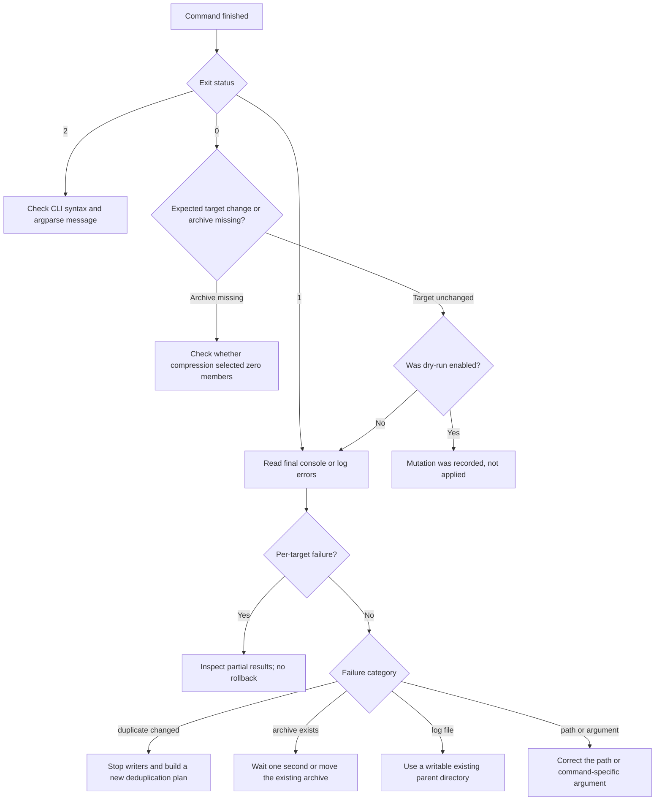

# Troubleshooting

## Start With Dry-Run and the Log

Add `--dry-run` to inspect planned target mutations, and choose an explicit log
path when diagnosing a command:

```powershell
python main.py --command clean_folder --path ./tmp --dry-run --log ./file-manager.log --log-level DEBUG
```

Dry-run still traverses directories, reads metadata, and hashes file contents for
deduplication. It can also create or append to the log file.

## Diagnostic Path

Start with the process exit status, then narrow the failure using the final log
messages and the artifact you expected:



The chart is a routing aid. The sections below provide searchable messages and
recovery steps.

## Exit Code 2: CLI Syntax Was Rejected

`argparse` exits with status `2` before command execution for malformed CLI
syntax. Common causes are a missing `--command` or a non-integer value for
`--max-workers`. Run `python main.py --help` and compare the argument spelling
with the [user guide](user-guide.md).

## Exit Code 1: The Command Failed

Status `1` covers unsupported commands, missing command-specific arguments,
invalid paths, validation failures, unexpected exceptions, and structured
results containing failed work. Read the final error lines in the console or log.

Common path messages:

- `Path not found`: the supplied path does not exist from the process working
  directory.
- `Path is not a directory`: the command requires a directory but received a
  file or another non-directory path.
- `'max_workers' must be a positive integer`: use `1` or a larger integer.

The shared parser accepts options for every command. Supplying an option that the
selected command does not consume does not configure that command.

## A Command Changed Some Targets Before Failing

Deletion and deduplication can report a partial failure: successful earlier
mutations remain applied, failed targets remain, and processing continues where
the Command supports per-target `OSError` aggregation. There is no rollback.
Use the result counts and per-target log messages to identify what remains, then
run dry-run again before retrying. See [Partial Failures and Deduplication
Revalidation](safety-model.md#partial-failures-and-deduplication-revalidation)
for the executor sequence and result-count semantics.

## A Duplicate Was Not Deleted

Deduplication leaves a duplicate in place when it or its keeper no longer matches
the planned SHA-256 digest, or when either file's observed state changes during
revalidation. This protects against deleting based on a stale plan. Re-run
deduplication to build a new plan after writers have stopped changing the files.
The [safety model](safety-model.md#partial-failures-and-deduplication-revalidation)
documents the exact digest and file-state checks.

File symlinks are excluded from deduplication and therefore are not reported as
duplicate candidates.

## No Archive Was Created

When no files match the extension and name filters, compression succeeds with one
skipped unit and intentionally creates no archive. Re-run with `--dry-run` and
fewer filters to inspect the selection.

## The Archive Already Exists

Archive names have one-second timestamp precision. Compression never overwrites
an existing destination, including one created concurrently. Wait at least one
second and retry, or move the existing archive if a second archive for the same
timestamp is required. A failed publication removes its temporary output and
keeps the existing archive. See [Archive Publication](safety-model.md#archive-publication)
for the temporary-file and `os.link` flow.

## The Log File Was Not Created

Relative `--log` paths are resolved from the current working directory. Logging
does not create missing parent directories. If the file handler cannot be
created, the application falls back to console logging. Create the parent
directory or use a writable existing directory, then retry.

Unrecognized `--log-level` values fall back to `INFO`; use a standard Python
logging level such as `DEBUG`, `INFO`, `WARNING`, `ERROR`, or `CRITICAL`.

## Hidden Files Were Selected Unexpectedly

A basename beginning with `.` is hidden on every supported platform. On Windows,
the hidden file attribute is an additional hidden criterion. Hidden status is not
inherited from parent directories. Use an exact, case-sensitive
`--excluded-names` value to protect a known basename.

## Symlinks Need Special Care

Deduplication excludes file symlinks, and empty-directory deletion excludes
directory symlinks. Shared file filtering may select a file symlink when it
resolves to a regular file. Deletion unlinks the symlink rather than its target;
compression reads the selected member through the symlink. Inspect a dry-run log
before operating on a tree that contains links. See [Symlink
Treatment](safety-model.md#symlink-treatment) for the operation-specific policy.
