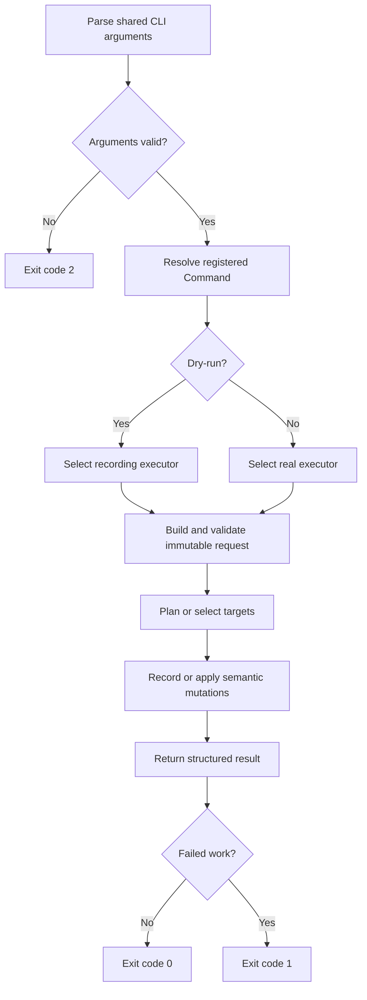

# User Guide

## Invocation

Run File Manager from the repository root:

```powershell
python main.py --command <command> [options]
```

The CLI uses one shared argument parser rather than per-command subparsers.
`--command` is required. Arguments that do not belong to the selected command
may be accepted by the parser but are ignored by that command.

Common options:

| Option | Default | Meaning |
| --- | --- | --- |
| `--command` | required | One of the six command names documented below. |
| `--log` | `app.log` | Diagnostic log path, resolved from the current working directory. |
| `--log-level` | `INFO` | Python logging level name. Unrecognized names fall back to `INFO`. |
| `--dry-run` | false | Record planned target mutations without applying them. |

## How a Command Runs

Every Command follows the same dispatch and result path:



## Safety Model

Run destructive operations with `--dry-run` first. Dry-run uses a recording
executor, so planned target-file mutations have `applied=False`; traversal,
validation, metadata reads, and content hashing still occur. Diagnostic logging
may create or append to the configured log file.

Commands aggregate supported per-target failures and continue with later
targets. Already completed mutations are not rolled back when a later target
fails. Check the process exit status and log before assuming every target was
processed. See the [safety model](safety-model.md) for filtering, symlinks,
partial failures, deduplication revalidation, and archive publication.

## Commands

### deduplicate

```powershell
python main.py --command deduplicate --directory ./photos --max-workers 4 --dry-run
```

`--directory` is required. `--max-workers` defaults to `1` and must be a positive
integer. The command recursively scans regular files, excludes file symlinks,
and computes SHA-256 content digests. It builds the complete deduplication plan
before deleting any duplicate.

Within each digest group, the lexicographically smallest normalized absolute
path is the keeper. A failed pre-deletion revalidation leaves that duplicate in
place, records a failure, and allows later duplicates to continue. The exact
checks are documented in the [safety model](safety-model.md).

Result units are planned duplicates: `attempted` is the number of duplicates,
`succeeded` is the number deleted or recorded by dry-run, and `failed` is the
number that could not be deleted.

### delete_by_extension

```powershell
python main.py --command delete_by_extension --path ./downloads --extensions tmp,log --dry-run
```

`--path` and a non-empty comma-separated `--extensions` value are required. The
command recursively deletes matching files at every depth. Extension matching
is case-insensitive and accepts values with or without a leading dot. Only the
final suffix is compared, so `archive.tar.gz` has extension `gz`.

### clean_folder

```powershell
python main.py --command clean_folder --path ./tmp --excluded-names keep.txt,.gitkeep --dry-run
```

`--path` is required. The command recursively deletes files at every depth,
including hidden files, but does not delete directories. `--excluded-names` is
optional; each value is matched against an exact, case-sensitive basename at
every depth.

### delete_empty

```powershell
python main.py --command delete_empty --path ./project --recursive --dry-run
```

`--path` is required. Without `--recursive`, the command considers only direct
children that are already empty. With `--recursive`, it plans directories
deepest-first so deleting empty children can make their parents eligible in the
same run. The supplied root is never deleted, and directory symlinks are not
candidates.

Result units are planned directories. Dry-run records the same child-first plan
that real execution consumes.

### delete_hidden_files

```powershell
python main.py --command delete_hidden_files --path ./repo --excluded-names .env --dry-run
```

`--path` is required. The command recursively deletes files whose own basename
starts with `.` on every supported platform. On Windows it also selects files
whose own attributes include the hidden flag. A file does not become hidden
merely because one of its parent directories is hidden. Optional excluded names
use exact, case-sensitive basename matching.

### compress_files

```powershell
python main.py --command compress_files --path ./logs --extensions log,txt --excluded-names debug.log --dry-run
```

`--path` is required. The command recursively selects files and preserves their
paths relative to the source directory in the ZIP. Optional extension and name
filters use the same matching rules as the deletion commands.

The archive is created beside the source directory as
`<folder-name>_<YYYYMMDD_HHMMSS>.zip`. No matching files produces no archive and
one skipped result. Real execution does not overwrite an existing destination.
See the [safety model](safety-model.md) for temporary-file publication, timestamp
collisions, cleanup, and hard-link requirements.

Result units are archives rather than members: a non-empty selection has one
attempt regardless of the number of files in the ZIP.

## Exit Statuses

- `0`: the selected command returned a result with no failed work.
- `1`: validation, dispatch, execution, or one or more result operations failed.
- `2`: `argparse` rejected CLI syntax before command execution, such as a missing
  `--command` or a non-integer `--max-workers` value.

An empty selection can still be successful. For example, empty compression
returns `0`, creates no archive, and records one skipped unit.
